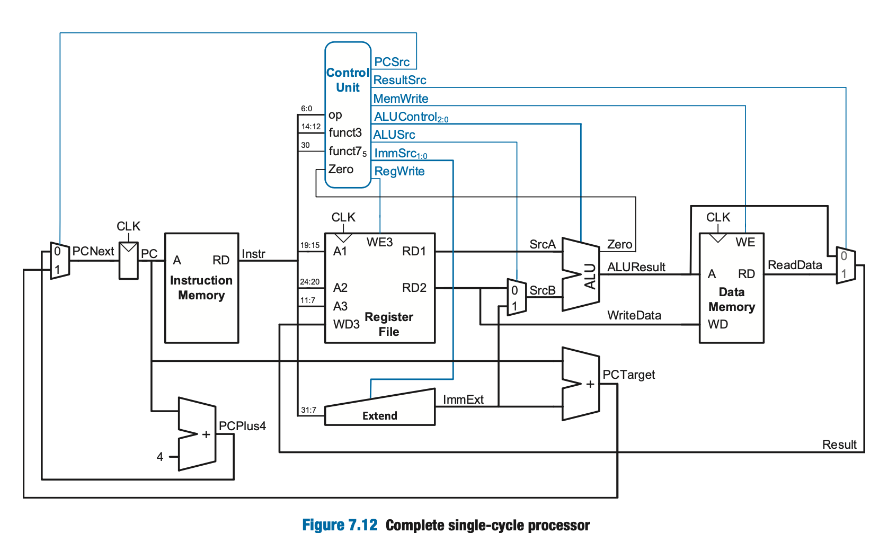

# RISC-V Single-Cycle Processor: RTL to GDSII Flow

This project is a complete implementation of a 32-bit RISC-V (RV32I) single-cycle CPU. The architecture follows the design specifications detailed in "Digital Design and Computer Architecture: RISC-V Edition" by Harris & Harris. The goal of this project was to move beyond functional simulation and complete the full physical design cycle, resulting in a tape-out-ready GDSII file.

## Architectural Design

The processor implements the base integer instruction set. The datapath and control unit were modeled in SystemVerilog, focusing on a clean separation between the combinational logic of the ALU and the sequential elements of the register file and PC.

The following diagram from Harris & Harris served as the primary reference for the control unit and datapath integration:

## Physical Design and Implementation Flow

The transition from RTL to silicon was managed through an open-source EDA toolchain. This involved several distinct stages of hardware synthesis and physical verification.

### 1. Verification and Logic Synthesis
Initial functional verification was performed using Icarus Verilog. Once the RTL passed the testbench suite, the logic was synthesized into a gate-level netlist. During this stage, I mapped the design to standard cells while ensuring the logic correctly reflected the single-cycle timing requirements.

### 2. Static Timing Analysis (STA)
Because single-cycle architectures are limited by the longest path (usually the Load Word instruction), I performed extensive STA. I analyzed the critical path starting from the Program Counter, through the Instruction Memory, Register File, ALU, Data Memory, and back to the Register File write-back stage. 

### 3. PPA Optimizations
* **Power:** Minimized high-frequency switching nets through better cell placement.
* **Performance:** Optimized the critical path to maximize the achievable clock frequency.
* **Area:** Used Magic VLSI to refine the floorplan, ensuring high cell density while maintaining routability and meeting DRC requirements.

### 4. Physical Layout (GDSII)
The final physical layout was generated after successful Design Rule Checks (DRC) and Layout vs. Schematic (LVS) verification. The layout accounts for power distribution straps, clock routing, and signal integrity.

The final GDSII output is shown below:

## Technical Stack
* **HDL:** SystemVerilog
* **Simulation:** Icarus Verilog, GTKWave
* **Circuit Simulation:** Spice
* **Layout & VLSI:** Magic VLSI
* **Reference:** Harris & Harris RISC-V Edition
